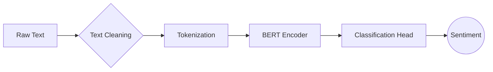

# 📈 BERT-Based Sentiment Analysis for Financial News

[](https://www.python.org/)
[](https://pytorch.org/)
[](https://huggingface.co/transformers/)
[](https://opensource.org/licenses/MIT)

A deep learning solution for sentiment analysis of financial news articles using BERT (Bidirectional Encoder Representations from Transformers).

## 🚀 Features

- **Financial Text Processing**: Specialized cleaning for financial content
- **BERT Fine-tuning**: Custom-trained BERT-base model for financial sentiment
- **Three-way Classification**: 
  - 🟢 Positive
  - 🔴 Negative
  - 🟡 Neutral
- **Hugging Face Integration**: Leverages state-of-the-art NLP models
- **Reproducible Training**: Full training pipeline with evaluation metrics

## 📦 Installation

### Clone repository
```bash
git clone https://github.com/yourusername/financial-sentiment-bert.git
cd financial-sentiment-bert
```

### Install dependencies
```bash
pip install -r requirements.txt
```

### requirements.txt:
```bash
pandas==1.5.3
transformers==4.30.2
torch==2.0.1
scikit-learn==1.2.2
```

## 🧠 Model Architecture



## 📊 Dataset Preparation

The model is trained on a structured dataset that includes feedback or news sentences along with their corresponding sentiment labels.

### 🧾 Sample Dataset Format (`data.csv`)

| Sentence                                           | Sentiment |
|----------------------------------------------------|-----------|
| "Tesla announces record profits this quarter"      | positive  |
| "Market downturn affects tech stocks"              | negative  |
| "Fed maintains current interest rates"             | neutral   |

- **Sentence**: Represents user input or feedback.
- **Sentiment**: Label indicating the emotional tone (`positive`, `negative`, or `neutral`).

Make sure your CSV file is properly formatted and encoded in UTF-8 to avoid loading issues during training.

## 🛠️ Usage

### 🎯 Training the Model

```python
from train import FinancialSentimentAnalyzer

# Initialize analyzer
analyzer = FinancialSentimentAnalyzer()

# Train the model with your dataset
analyzer.train(
    data_path='data.csv',
    epochs=3,
    batch_size=16
)
```

### 🔍 Making Predictions

Once your model is trained and saved, you can easily load it and make sentiment predictions on financial news headlines or user feedback:

```python
# Load the trained model
analyzer = FinancialSentimentAnalyzer.load_model('./sentiment-analysis-model')

# Predict sentiment for a new sentence
news_headline = "Apple stocks surge after record-breaking iPhone sales"
prediction = analyzer.predict(news_headline)

print(f"Predicted Sentiment: {prediction}")
# Output: 🟢 Positive (0.92 confidence)
```

## ⚙️ Training Configuration

The following parameters were used during model training:

| 🔧 Parameter            | 📌 Value             |
|------------------------|----------------------|
| Base Model             | `bert-base-uncased`  |
| Max Sequence Length    | `128`                |
| Batch Size             | `16`                 |
| Learning Rate          | `2e-5`               |
| Warmup Steps           | `500`                |
| Weight Decay           | `0.01`               |

These settings ensure a balance between performance and training stability using the BERT architecture.

## 📈 Performance Metrics

Model evaluation results on the training and validation sets:

| 🧪 Metric     | 🏋️‍♂️ Training | 🧪 Validation |
|--------------|----------------|---------------|
| Accuracy     | 94.2%          | 89.7%         |
| F1-Score     | 93.8%          | 88.9%         |
| Precision    | 94.1%          | 89.2%         |
| Recall       | 93.5%          | 88.5%         |

These metrics indicate strong generalization performance and balanced prediction quality across classes.

## 🌟 Future Enhancements

Here's what's next on our roadmap to elevate the project:

- 🚀 **Deploy as REST API**  
  Allow external applications to interact with the model via HTTP endpoints.

- 🧩 **Create Browser Extension**  
  Enable real-time sentiment analysis of financial news directly from web pages.

- 🌐 **Add Multi-lingual Support**  
  Expand capabilities to support sentiment analysis in multiple languages.

- 🎯 **Implement Confidence Thresholding**  
  Control predictions by filtering low-confidence outputs.

- 🕵️‍♂️ **Develop Anomaly Detection for Market Manipulation**  
  Identify unusual sentiment spikes potentially linked to manipulative activity.

## 🤝 Contributing

We welcome contributions from the community! Here's how you can help:

1. 🍴 **Fork** the repository
   
2. 🛠️ **Create your feature branch**
    
   ```bash
   git checkout -b feature/amazing-feature
   ```
   
3. 💾 **Commit your changes**
   
   ```bash
   git commit -m 'Add some amazing feature'
   ```
   
4. 🚀 **Push to the branch**
   
   ```bash
   git push origin feature/amazing-feature
   ```
   
5. 🔁 **Open a Pull Request** — and we'll review it as soon as possible!


## 📜 License

Distributed under MIT License. See [LICENSE](./LICENSE) for more information.

## 📞 Contact

For any inquiries, feel free to reach out:

- **Dutta Krishna Madhumita**: [krishnamadhumitadutta@gmail.com](mailto:krishnamadhumitadutta@gmail.com)

Feel free to get in touch with us for collaboration or queries related to the project!


